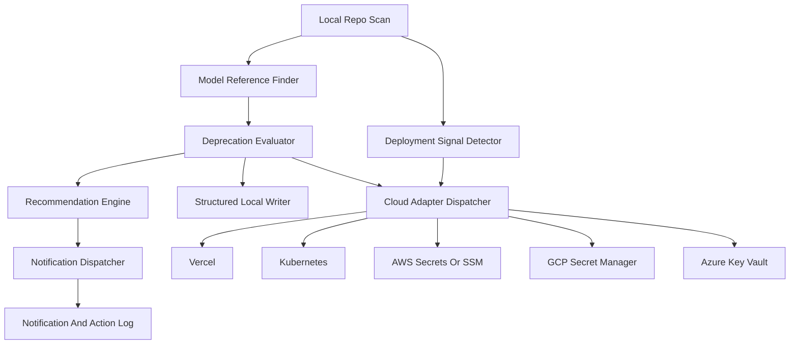

# Chowkidar — Enhanced Task Brief (ETB)

## Status: APPROVED (Phase 11 in progress)

---

## Problem Statement

LLM providers are releasing and sun-setting models at an accelerating pace. Developers hard-code model identifiers in `.env` files and configs, then get blindsided when a model is deprecated — causing production failures, degraded outputs, or silent billing changes. There is no local, privacy-respecting tool that watches for these deprecations and alerts the developer proactively.

## Objective

A **local-first Python package** that:

1. Scans project files for LLM model identifiers.
2. Maintains a local registry of model deprecation/sunset dates (scraped from provider sources).
3. Uses a **local SLM** (via Ollama) to parse unstructured deprecation announcements into structured data.
4. Alerts the user via native OS notifications at configurable thresholds.
5. **Writes IDE rules files** (Cursor `.mdc`, Claude Code `CLAUDE.md`, Copilot `.github/copilot-instructions.md`, etc.) to passively instruct AI assistants to update deprecated models — **zero config, works everywhere**.
6. Exposes an **MCP server** as the power-user layer for real-time queries and interactive updates.

**Everything stays on the local machine. Zero data exfiltration.**

---

## Architecture (Four Layers)

### Layer 1 — The Scanner (Passive)
- Scans filesystem for `.env`, `.env.local`, `.env.*`, `docker-compose.yml`, `settings.py`, `constants.ts`, `.yaml`, `.toml`, `.json`, `pyproject.toml`.
- Uses format-aware parsers + regex to find model strings matching known patterns (e.g., `gpt-[0-9a-z.-]+`, `claude-[0-9a-z.-]+`, `gemini-[0-9a-z.-]+`, `mistral-[0-9a-z.-]+`).
- Maps variable names to their model string values.
- Normalizes model strings to canonical IDs (e.g., `gpt-4o-2024-08-06` → `openai/gpt-4o-2024-08-06`).

### Layer 2 — The Registry (Dynamic) + Local SLM
- Local SQLite database at `~/.chowkidar/registry.db`.
- **Shadow Scraper** runs every 24 hours (when online):
  - OpenAI: `/v1/models` endpoint (structured `deprecation_date` field).
  - Anthropic: Release notes / docs pages (semi-structured scraping).
  - Google: Vertex AI / AI Studio deprecation schedules.
  - Mistral: API docs / changelog.
- Each model record includes: `sunset_date`, `replacement`, `replacement_confidence`, `breaking_changes`, `source_url`.
- **Local SLM via Ollama** (see dedicated section below) parses unstructured "sunset announcement" blog posts into structured JSON when regex/heuristic parsing fails.

### Layer 3 — The Sentinel (Active)
- Background daemon process.
- Cross-references scanner results against registry every 4 hours.
- Fires OS-native notifications at thresholds:
  - **>90 days**: No action.
  - **30 days**: Low-priority desktop notification.
  - **7 days**: Urgent desktop notification + terminal warning.
  - **Sunset reached**: Blocking warning via IDE rules + MCP.
- Notification deduplication: tracks `(model, project, threshold)` to avoid spam.
- Snooze support: `chowkidar snooze <model> --days N`.

### Layer 4 — IDE Integration (Rules + MCP)
- **Primary mechanism**: Write/update IDE rules files so AI assistants are passively aware of deprecations.
- **Secondary mechanism**: MCP server for real-time queries and interactive tool calls.
- See dedicated sections below for both.

---

## Local SLM Integration (Ollama)

### Purpose
Parse unstructured provider blog posts, changelogs, and announcement pages into structured deprecation data when regex/heuristic parsing is insufficient.

### Installation Flow (`chowkidar setup`)
1. **Check for Ollama**: `which ollama` / check if `ollama` binary exists.
2. **If missing**: Prompt user and install automatically:
   - macOS: `brew install ollama` (or `curl -fsSL https://ollama.com/install.sh | sh`)
   - Linux: `curl -fsSL https://ollama.com/install.sh | sh`
   - Windows: Download installer via `httpx`
3. **Start Ollama service**: `ollama serve` (if not already running).
4. **Pull model**: `ollama pull gemma3:1b` (~815MB, one-time download).
5. **Verify**: Run a test prompt to confirm the model responds.

### Model Choice
- **Default**: `gemma3:1b` — small footprint (~815MB), good at structured extraction.
- **Alternative**: `qwen2.5:0.5b` (~400MB) for very constrained systems.
- **Configurable**: `chowkidar config set slm_model <model_name>`.

### Usage within Chowkidar
- The SLM is invoked **only** during `chowkidar sync` when the scraper encounters unstructured text (blog posts, changelogs) that can't be parsed by regex.
- Prompt template extracts: `{ "model": string, "sunset_date": "YYYY-MM-DD", "replacement": string, "confidence": "high|medium|low" }`.
- Results are validated against a JSON schema before insertion into the registry.
- **Graceful degradation**: If Ollama is not installed/running, the scraper skips unstructured sources and logs a warning. Chowkidar remains fully functional with structured API sources alone.

### CLI Commands
```
chowkidar setup              # Full setup: check/install Ollama + pull SLM
chowkidar setup --skip-slm   # Setup without SLM (structured sources only)
chowkidar config set slm_model <name>  # Change SLM model
chowkidar slm status         # Check if Ollama is running and model is available
```

### Privacy
- The SLM runs **entirely locally** via Ollama.
- Only **public blog post text** (already fetched by the scraper) is sent to the local model.
- No `.env` content, API keys, or project data is ever sent to the SLM.

---

## IDE Rules Integration (Primary — Zero-Config)

### Concept
Instead of requiring users to configure MCP, Chowkidar **writes rules files directly into the project** that AI assistants auto-discover. When the AI edits a file containing a deprecated model string, it already knows to update it.

### Rules File Formats (per editor)

#### Cursor (`.cursor/rules/chowkidar-alerts.mdc`)
```markdown
---
description: Chowkidar — LLM model deprecation alerts
globs: ["**/.env*", "**/config.*", "**/settings.*", "**/constants.*", "**/docker-compose.*"]
alwaysApply: false
---

## Model Deprecation Alerts (auto-generated by Chowkidar)

The following models used in this project are deprecated or sunsetting soon.
When editing any file containing these model strings, update them to the recommended replacements.

| Variable | Current Model | Sunset Date | Replacement | Confidence |
|---|---|---|---|---|
| LLM_MODEL_NAME (.env) | gpt-3.5-turbo | 2026-04-01 | gpt-4o-mini | high |
| ANTHROPIC_MODEL (.env) | claude-2.1 | 2026-05-15 | claude-sonnet-4-20250514 | high |

Last updated: 2026-03-09T14:30:00Z by Chowkidar.
```

#### Claude Code (`.claude/rules/chowkidar-alerts.md`)
```markdown
---
description: Chowkidar — LLM model deprecation alerts
globs: ["**/.env*", "**/config.*", "**/settings.*"]
---

## Model Deprecation Alerts (auto-generated by Chowkidar)

(Same table content as above)
```

#### VS Code / GitHub Copilot (`.github/copilot-instructions.md`)
- Appends a `## Chowkidar Model Alerts` section to the existing file (or creates it).
- Uses `<!-- chowkidar:start -->` / `<!-- chowkidar:end -->` markers to update only its own section.

#### Windsurf (`.windsurfrules`)
- Appends a Chowkidar section with markers, similar to Copilot.

#### Antigravity
- Writes to Antigravity's rules file format (TBD based on their spec).

### Behavior
- **Auto-generated**: Daemon writes/updates rules files whenever it detects deprecations in a watched project.
- **Non-destructive**: Uses marker comments (`<!-- chowkidar:start/end -->`) to manage its own section without touching user-written rules.
- **Opt-out**: `chowkidar config set write_rules false` disables rules file generation.
- **`.gitignore`-friendly**: By default, adds the rules files to `.gitignore` (configurable). These are local developer alerts, not project config.

### Why Rules-First?
| Aspect | Rules Files | MCP Server |
|---|---|---|
| Setup effort | **Zero** — auto-discovered | User must edit MCP config |
| Server process | **None** — just a file | Must be running |
| Editor coverage | **All AI editors** | Only MCP-compatible |
| Real-time queries | No (updated by daemon) | **Yes** |
| Can call tools | No — instructs the AI | **Yes** |
| Complexity | **Trivial** | Moderate |

Rules handle the "passively instruct the AI to update models" use case perfectly. MCP adds interactive power for advanced users.

---

## MCP Server (IDE Integration — Power-User Layer)

### Transport
- `stdio` — IDE spawns the process, communicates over stdin/stdout.

### Tools Exposed
| Tool | Description | Default |
|---|---|---|
| `list_deprecated_models()` | Returns models in current project near/past sunset | Always available |
| `get_model_status(model_id)` | Returns deprecation info for a specific model | Always available |
| `update_model_env(file, var, new_model)` | Overwrites env var with recommended successor | **Requires `AUTO_UPDATE=true`** |

### IDE Support
- Cursor: Add to `~/.cursor/mcp.json`
- Claude Code: Add to `~/.claude/claude_desktop_config.json`
- VS Code: Via MCP extension config
- Antigravity: Via MCP config

### Context Injection
When connected, the MCP server provides context like:
> "Note: You are using `gpt-3.5-turbo` in this project. This model sunsets in 5 days. Recommended replacement: `gpt-4o-mini` (high confidence, no breaking changes)."

---

## CLI Commands

```
chowkidar setup                 # Full first-run setup: check/install Ollama + pull SLM
chowkidar setup --skip-slm      # Setup without SLM (structured sources only)
chowkidar scan [PATH]           # Scan a project directory for model strings
chowkidar sync                  # Fetch latest deprecation data from providers
chowkidar check [PATH]          # Cross-reference scan results with registry
chowkidar status                # Show daemon status, registry freshness, watched projects
chowkidar watch <PATH>          # Register a project for background monitoring
chowkidar unwatch <PATH>        # Unregister a project
chowkidar pin <model> [--reason]# Suppress notifications for a model
chowkidar unpin <model>         # Re-enable notifications
chowkidar snooze <model> --days # Temporarily suppress notifications
chowkidar daemon                # Start background daemon (foreground mode)
chowkidar install-service       # Install OS-native background service
chowkidar uninstall-service     # Remove OS-native background service
chowkidar logs [--tail N]       # View daemon logs
chowkidar mcp                   # Start MCP server (stdio mode, called by IDE)
chowkidar config                # View/edit configuration
chowkidar config set <key> <val># Set a config value (e.g., slm_model, write_rules, auto_update)
chowkidar update --dry-run      # Preview env changes without writing
chowkidar update                # Apply env changes (with backup)
chowkidar slm status            # Check if Ollama is running and SLM model is available
chowkidar rules write [PATH]    # Manually write/refresh IDE rules files for a project
chowkidar rules clean [PATH]    # Remove Chowkidar-generated rules files from a project
```

---

## Database Schema

```sql
CREATE TABLE models (
    id TEXT PRIMARY KEY,
    provider TEXT NOT NULL,
    aliases TEXT,                  -- JSON array
    sunset_date TEXT,              -- ISO 8601 or NULL
    replacement TEXT,              -- successor model id
    replacement_confidence TEXT,   -- "high" | "medium" | "low"
    breaking_changes BOOLEAN DEFAULT 0,
    source_url TEXT,
    last_checked_at TEXT,
    created_at TEXT DEFAULT (datetime('now'))
);

CREATE TABLE scan_results (
    id INTEGER PRIMARY KEY AUTOINCREMENT,
    project_path TEXT NOT NULL,
    file_path TEXT NOT NULL,
    variable_name TEXT,
    model_value TEXT NOT NULL,
    model_id TEXT,
    last_scanned_at TEXT
);

CREATE TABLE notification_log (
    id INTEGER PRIMARY KEY AUTOINCREMENT,
    project_path TEXT NOT NULL,
    model_id TEXT NOT NULL,
    threshold TEXT NOT NULL,
    notified_at TEXT DEFAULT (datetime('now')),
    snoozed_until TEXT
);

CREATE TABLE pinned_models (
    model_id TEXT PRIMARY KEY,
    reason TEXT,
    pinned_at TEXT DEFAULT (datetime('now'))
);

CREATE TABLE watched_projects (
    project_path TEXT PRIMARY KEY,
    added_at TEXT DEFAULT (datetime('now')),
    last_scanned_at TEXT
);
```

---

## Technical Stack

| Component | Library | Purpose |
|---|---|---|
| CLI | `typer` + `rich` | Commands, formatted output |
| Env parsing | `python-dotenv` | `.env` file read/write |
| Config parsing | `tomli`, `pyyaml` | `.toml`, `.yaml` support |
| HTTP client | `httpx` | Async provider scraping |
| Retry logic | `tenacity` | Exponential backoff for scraping |
| Database | `sqlite3` (stdlib) | Local registry |
| Local SLM | `ollama` (Python SDK) | Interface with Ollama for SLM inference |
| Notifications | `plyer` | Cross-platform desktop alerts |
| MCP server | `mcp` SDK | IDE integration (stdio) |
| Background | `schedule` | Periodic scan/sync loop |
| File safety | `filelock` | Concurrent `.env` access protection |
| Logging | `structlog` or stdlib | Structured logs with rotation |
| Testing | `pytest` + `respx` | Unit tests, HTTP mocking |

---

## Security & Privacy Constraints (Non-Negotiable)

1. **Zero exfiltration**: No `.env` content, API keys, or project paths sent externally.
2. **Local registry**: Deprecation data is downloaded TO the user, never uploaded FROM.
3. **Read-only defaults**: File modification requires explicit `AUTO_UPDATE=true` in `~/.chowkidar/config.toml`.
4. **Atomic writes**: All file modifications use write-to-temp + `os.replace` pattern.
5. **Automatic backups**: `.env.bak` created before any modification.
6. **File locking**: `filelock` prevents concurrent write corruption.

---

## Engineering Cases (Edge Cases & Concerns)

### Model String Normalization
- Different naming conventions across providers and proxy tools (LiteLLM, OpenRouter).
- Aliases like `gpt-4o`, `gpt-4o-2024-08-06`, `openai/gpt-4o` must resolve to the same canonical entry.

### Offline Resilience
- Registry shows `last_synced_at` in CLI output.
- Warning if registry is >48 hours stale.
- Daemon retries sync on reconnection (check connectivity before sync attempt).

### Multi-Project Support
- `chowkidar watch` registers project paths.
- Daemon iterates all watched projects during scan cycles.

### Intentional Pinning
- `chowkidar pin` suppresses alerts for models users intentionally keep.
- Pinned models still appear in `scan` output but marked as `[PINNED]`.

### Replacement Confidence
- `high`: Direct successor, same capabilities, provider-recommended.
- `medium`: Similar capabilities, minor behavior differences.
- `low`: Significant capability/pricing changes, manual review recommended.

### Notification Deduplication
- Track `(model, project, threshold)` tuples in `notification_log`.
- Don't re-notify for same threshold within 24 hours.

### Provider Plugin Architecture
- Abstract `ProviderAdapter` protocol for adding new providers.
- Each provider implements `fetch_models()` and `fetch_deprecations()`.
- Community can contribute new adapters.

### Rollback
- `chowkidar update` creates `.env.chowkidar.bak` before modification.
- Future: `chowkidar rollback` to restore from backup.

### Cross-Platform Daemon
- MVP: `chowkidar daemon` runs in foreground (user manages lifecycle).
- Later: `chowkidar install-service` generates launchd plist (macOS) / systemd unit (Linux).

### Local SLM Edge Cases
- **Ollama not installed**: `chowkidar setup` handles installation. If user declines, SLM features degrade gracefully.
- **Ollama installed but not running**: Auto-start via `ollama serve` as a subprocess, or prompt user.
- **Model not pulled**: `chowkidar setup` pulls it. If missing at runtime, skip SLM parsing with a warning.
- **Insufficient disk/RAM**: Detect available resources before pulling. Suggest smaller model (`qwen2.5:0.5b`) or `--skip-slm`.
- **SLM hallucination**: All SLM outputs are validated against a strict JSON schema + sanity checks (e.g., sunset_date must be a valid future date, model name must match known provider patterns). Rejected outputs are logged and discarded.
- **Concurrent Ollama usage**: User might be running other Ollama workloads. Chowkidar uses low-priority requests and respects Ollama's queue.

### IDE Rules Edge Cases
- **Multiple editors on same project**: Write rules for ALL detected editors (check for `.cursor/`, `.claude/`, `.github/` directories).
- **User has existing rules files**: Never overwrite — use marker comments (`<!-- chowkidar:start -->` / `<!-- chowkidar:end -->`) to manage only Chowkidar's section.
- **Rules file format changes**: If an editor updates their rules format, Chowkidar must adapt. Template-based generation makes this easier.
- **User opts out**: `chowkidar config set write_rules false` disables all rules file generation. `chowkidar rules clean` removes existing ones.
- **Stale rules**: Rules files include a `Last updated` timestamp. The daemon refreshes them on every check cycle.

---

## Development Phases

| Phase | Scope | Key Deliverable |
|---|---|---|
| **1** | CLI + Scanner | `chowkidar scan` — parse `.env`/configs, extract model strings, output table |
| **2** | Registry + Sync | SQLite DB + `chowkidar sync` — fetch deprecation data from OpenAI API + Anthropic |
| **3** | Comparison Engine | `chowkidar check` — cross-reference scan vs registry, output warnings |
| **4** | IDE Rules Writer | `chowkidar rules write` — generate/update rules files for Cursor, Claude Code, Copilot, Windsurf |
| **5** | Daemon + Notifications | `chowkidar daemon` — background loop, OS notifications + auto-refresh rules files |
| **6** | Local SLM Setup | `chowkidar setup` — Ollama check/install, model pull, unstructured blog parsing in sync |
| **7** | MCP Server | `chowkidar mcp` — stdio MCP server with `list_deprecated_models` + `update_model_env` |
| **8** | Auto-Update + Safety | Opt-in `.env` modification with backup, dry-run, file locking |
| **9** | Provider Plugins + Polish | Adapter pattern, Google/Mistral support, `install-service` for OS daemons |

---

## Project Structure (Proposed)

```
chowkidar/
├── pyproject.toml
├── README.md
├── src/
│   └── chowkidar/
│       ├── __init__.py
│       ├── cli.py                  # Typer CLI entry point
│       ├── scanner/
│       │   ├── __init__.py
│       │   ├── env_parser.py       # .env file parsing
│       │   ├── config_parser.py    # yaml/toml/json parsing
│       │   └── patterns.py         # Model string regex patterns
│       ├── registry/
│       │   ├── __init__.py
│       │   ├── db.py               # SQLite operations
│       │   └── schema.sql          # DB schema
│       ├── providers/
│       │   ├── __init__.py
│       │   ├── base.py             # ProviderAdapter protocol
│       │   ├── openai.py           # OpenAI scraper
│       │   ├── anthropic.py        # Anthropic scraper
│       │   ├── google.py           # Google scraper
│       │   └── mistral.py          # Mistral scraper
│       ├── slm/
│       │   ├── __init__.py
│       │   ├── setup.py            # Ollama check/install/pull logic
│       │   ├── client.py           # Ollama Python SDK wrapper
│       │   └── prompts.py          # Prompt templates for structured extraction
│       ├── sentinel/
│       │   ├── __init__.py
│       │   ├── daemon.py           # Background daemon loop
│       │   ├── notifier.py         # OS notification logic
│       │   └── service.py          # OS service installer
│       ├── ide/
│       │   ├── __init__.py
│       │   ├── rules_writer.py     # Write/update rules files per editor
│       │   ├── detector.py         # Detect which editors are in use
│       │   └── templates/          # Jinja2/string templates for each editor format
│       │       ├── cursor.py
│       │       ├── claude_code.py
│       │       ├── copilot.py
│       │       └── windsurf.py
│       ├── mcp_server/
│       │   ├── __init__.py
│       │   └── server.py           # MCP server implementation
│       ├── updater/
│       │   ├── __init__.py
│       │   └── env_writer.py       # Safe .env modification
│       └── config.py               # User config management
├── tests/
│   ├── fixtures/                   # Sample API responses, blog posts
│   ├── test_scanner.py
│   ├── test_registry.py
│   ├── test_providers.py
│   ├── test_slm.py
│   ├── test_ide_rules.py
│   ├── test_sentinel.py
│   └── test_mcp.py
└── project.md                      # This file
```

---

## Trade-offs

| Decision | Choice | Trade-off |
|---|---|---|
| SQLite vs JSON flat file | SQLite | Slightly heavier but enables proper querying, indexing, and concurrent access |
| Rules-first vs MCP-first | Rules-first | Zero config, universal editor support, but static (daemon refreshes periodically). MCP is secondary for power users |
| Ollama SLM vs no SLM | Ollama (opt-in) | Adds ~815MB disk + install complexity, but enables parsing unstructured deprecation announcements. Graceful degradation without it |
| `gemma3:1b` vs larger models | `gemma3:1b` | Good enough for structured extraction, runs on any machine. Larger models waste resources for this task |
| stdio MCP vs HTTP MCP | stdio | Simpler, more secure (no port exposure), but one process per IDE connection |
| `plyer` vs native APIs | `plyer` | Cross-platform convenience vs less native look/feel |
| Foreground daemon (MVP) vs OS service | Foreground first | Faster to ship, but user must manage process manually |
| Regex scanning vs AST parsing | Regex first | Catches most cases fast, but may produce false positives in comments/strings |
| Scraping docs vs official APIs | Both | APIs are reliable but incomplete; scraping is fragile but catches announcements faster |
| Rules in `.gitignore` vs committed | `.gitignore` by default | Rules are local dev alerts, not project config. Configurable for teams that want shared alerts |

---

## Open Questions

1. Should Chowkidar support scanning **git history** for model strings (to catch models used in other branches)?
2. Should there be a **web dashboard** (local Flask/Streamlit) or is CLI + notifications sufficient for MVP?
3. How should we handle **proxy services** (OpenRouter, LiteLLM, AWS Bedrock) where the model string format differs from the provider's native format?
4. Should rules files be **committed to git** (team-wide alerts) or **gitignored** (personal alerts only) by default?
5. For the SLM, should Chowkidar also support **llama.cpp** directly (via `llama-cpp-python`) as an alternative to Ollama, to avoid the Ollama dependency?
6. Should `chowkidar setup` auto-run on first `pip install chowkidar` via a post-install hook, or require explicit `chowkidar setup`?

---

## Feature Addition: Automatic Workspace Watching & Service Robustness (Phase 10)

### Objectives
1. **Background Monitoring (IDE-Closed)**: Ensure that folders are tracked for LLM model deprecations even when VS Code/other editors are completely closed.
2. **Auto-Watch on Open (VS Code Integration)**: Update the VS Code extension to automatically run `chowkidar watch <workspace_folder>` on activation. This registers the workspace with the background database without requiring the developer to run CLI commands manually.
3. **Notification Verification Utility**: Implement a `chowkidar test-notify` CLI command that lets developers fire a mock desktop notification immediately. This helps trigger OS prompt dialogs (macOS notification permission requests) and confirms that desktop notifications are correctly set up and configured.
4. **Service Robustness**: Ensure that the background daemon works flawlessly via local OS scheduling utilities (launchd on macOS, systemd on Linux, Task Scheduler on Windows) and remains lightweight.

### Implementation Plan

#### Part A: CLI Notification Test Command
- Add `test-notify` command in `src/chowkidar/cli.py`.
- Calling `chowkidar test-notify` fires a mock desktop notification titled "Chowkidar Notification Test" with a message saying "If you see this, Chowkidar's cross-platform native notification system is functioning perfectly!".

#### Part B: Automatic Workspace Watching in VS Code Extension
- Implement `runWatch(projectPath)` in `extension/src/chowkidarBridge.ts` to call `chowkidar watch <projectPath>`.
- In `extension/src/extension.ts`, call `runWatch` on activation for the current open workspace folder so it is automatically registered with the daemon database.

#### Part C: Test Additions & Validation
- Add tests in `tests/test_sentinel.py` to verify the new CLI notify commands and register functions work.
- Validate by running `poetry run pytest`.

---

> **Phase 10 Status**: Approved and Implemented.

---

## Feature Addition: Native Report Notifications & Enhanced Click-throughs (Phase 11)

### Objectives
1. **PyPI Presentation Polish**: Include clear version badges, links, and detailed rendering instructions in the `README.md` that publishes directly to PyPI, showing users how Chowkidar performs as a watchdog.
2. **Actionable HTML/Markdown/JSON Reports**: Update reports to visually highlight the exact deprecated or sunsetting model strings, variables, and files. Introduce an interactive local server/bridge mechanism in Chowkidar that runs a CLI command or serves a local endpoint to open the directory/env files of the deprecated model in the user's default editor (with support for `CHOWKIDAR_EDITOR`, `VISUAL`, `EDITOR`, or common IDEs like Cursor and VS Code, falling back to OS file manager).
3. **Cross-OS Native Click-throughs**: Refactor the cross-platform notification module to support clicking/activation of notifications on macOS, Linux, and Windows. Clicking a notification must trigger the full report viewer flow and highlight the affected file or project.
4. **Daemon Integration & Real alerts**: Replace mock notification text with descriptive, actual model deprecation warning wording (e.g. detailing the model name, variable name, sunset date/days left, and recommended replacement model). Wire the daemon to dynamically generate report files when deprecations are found, and pass the report paths to the native click action handlers.
5. **Universal OS Support & Multi-OS Safety**: Fully support macOS, Linux, and Windows path formats, quoting, and process triggers. Ensure full test coverage and verification.

### Implementation Plan

#### Part A: README/PyPI Presentation
- Add PyPI badges and clear package metadata to `README.md`.
- Explain how README renders on PyPI and add details on the local report/notification features.

#### Part B: Actionable Reports & Editor Triggers
- Update `src/chowkidar/report.py` HTML generation to highlight deprecations with strong styling.
- Add an interactive webview action or local loopback command execution trigger in the report so clicking a button opens the target directory or file in the default/configured editor.
- Implement editor resolution: read `CHOWKIDAR_EDITOR`, `VISUAL`, `EDITOR`, check if `cursor` or `code` are on path, and fall back to opening the folder using the native explorer (`open`, `xdg-open`, or `explorer.exe`).

#### Part C: Clickable Native OS Notifications
- In `src/chowkidar/sentinel/notifier.py`, extend native functions to handle click/activation actions.
- On macOS, use `osascript` to trigger custom event links or look into lightweight native execution wrapper to handle click detection; or implement an OS-specific background click listener if possible.
- On Linux, use `notify-send` with action support where supported, or standard click callbacks.
- On Windows, leverage PowerShell Toast notifications with a protocol link or direct action command argument to start our local report viewer/editor launcher.

#### Part D: Daemon Wiring & Realistic Messages
- Replace mock test messages with real, dynamic warning strings showing specific model information.
- Configure `test-notify` to show realistic deprecation alerts and test the end-to-end report click-through and folder-opening pathways.

#### Part E: Test Additions & OS Safety
- Write robust pytest tests under `tests/test_notifier.py`, `tests/test_report.py`, and a new CLI integration test suite.
- Verify path formatting, quoting, and escape behavior on Windows, macOS, and Linux.

---

> **Phase 11 Status**: APPROVED (User explicitly requested implementation).

---

## Feature Addition: Notification-First Deprecation Governance (Phase 12)

### Status

**PENDING APPROVAL**

Implementation must not begin until this ETB is explicitly approved.

### Enhanced Task Brief

Chowkidar must become a notification-first model deprecation governance tool. Its primary responsibility is to detect model deprecation risk, notify the right people, explain replacement options and risks, and keep a durable audit trail. It must not silently change the selected model.

Model changes are allowed only under strict policy:

1. Default behavior is notify-only.
2. Local automatic writes require `auto_update = true`.
3. Automatic writes are allowed only when exactly one day is left before the model sunset.
4. Automatic local writes are limited to structured configuration files: `.env`, JSON, YAML, TOML, and docker-compose YAML.
5. Source-code references are scan/report/notify only; they are not auto-edited.
6. Cloud/deployed environment writes require an explicit adapter, explicit credentials, a successful dry-run, a confident mapping to the remote variable/secret, and complete audit logging.

### Core Clarification: Deployed Apps Cannot Be Known From Local Files Alone

Chowkidar cannot prove that an application is deployed by scanning local files. Local files can only provide deployment signals, such as:

- Vercel config or project metadata.
- Kubernetes manifests, Helm charts, Kustomize overlays, Secrets, or ConfigMaps.
- Terraform or cloud provider references.
- GitHub Actions, GitLab CI, or other deployment workflows.
- Dockerfiles and docker-compose files.
- References to AWS, GCP, or Azure secret names and runtime variables.

Therefore, Chowkidar must represent local deployment detection as evidence with confidence, not certainty. A deployed target is confirmed only when a configured cloud adapter authenticates and verifies the remote project, cluster object, secret, or environment variable exists.

### Objectives

1. **Notification-first behavior**: notify on deprecation risk without changing models by default.
2. **Per-reference auditability**: log notification attempts, delivery results, recommendation shown, write eligibility, write attempts, failures, rollback metadata, and cloud adapter results.
3. **Structured-file support beyond `.env`**: scan broadly and support safe writes to `.env`, JSON, YAML, TOML, and docker-compose YAML.
4. **Deployment signal detection**: infer possible deployment surfaces from local evidence and show confidence plus evidence files.
5. **Cloud adapter support**: include first-round adapters for Vercel, Kubernetes, AWS Secrets Manager/SSM Parameter Store, GCP Secret Manager, and Azure Key Vault.
6. **Unified recommendations**: provide one recommendation engine used by notifications, reports, CLI, MCP, IDE rules, and update flows.
7. **Commercial and capability risk reporting**: explain cost impact, prompt/commercial behavior risks, privacy/provider risk, capability regressions, and future compatibility risks.
8. **Fallback-first execution**: when sync, recommendation, notification, local writes, or cloud writes fail, Chowkidar must notify/log the blocker and avoid unsafe mutation.

### Proposed Architecture



### Implementation Plan

#### Part A: Notification and Audit Model

- Refactor daemon notification dedupe from project-level `folder_summary` to per-reference tracking.
- Track at least: `project_path`, `file_path`, `key_path` or variable name, canonical model, threshold, notification channel, delivery status, webhook status, report path, recommendation shown, and timestamp.
- Add explicit action audit records for local writes, cloud dry-runs, cloud writes, skipped writes, failures, and rollback metadata.
- Do not mark a notification as successfully delivered if the OS notification or webhook failed.
- Keep snooze/pin semantics separate from notification delivery history.

#### Part B: Threshold Policy

- Treat `>30 days` as report-only unless configured otherwise.
- Notify at `30d`, `7d`, `1d`, and `sunset`.
- Only the `1d` threshold can trigger automatic update evaluation.
- `sunset` should remain a warning/blocking status, but must not silently choose a new model after the deadline.

#### Part C: Structured Local Writers

- Keep scanning source files, but never auto-edit source code in this phase.
- Add a writer abstraction for supported structured files:
  - `.env`
  - JSON
  - YAML
  - TOML
  - docker-compose YAML
- Use exact parsed key paths from scan results.
- Refuse writes if a key path is ambiguous, duplicated, or cannot be safely round-tripped.
- Preserve file locking, backups, atomic writes, dry-run mode, and rollback metadata across all writers.

#### Part D: Deployment Signal Detector

- Add a detector that returns deployment evidence, confidence, and suggested adapter targets.
- Evidence should include local files and matched signals, not just a boolean.
- Possible states:
  - `none`: no deployment evidence found.
  - `possible`: weak local signals found.
  - `likely`: strong local signals found.
  - `confirmed`: cloud adapter authenticated and verified a remote target.
- Reports and notifications must clearly distinguish inferred local signals from confirmed remote deployment state.

#### Part E: Cloud Adapter Layer

- Add a cloud adapter protocol with operations for discovery, dry-run, write, verify, and rollback/reference metadata.
- Implement first-round adapters for:
  - Vercel project environment variables.
  - Kubernetes Secrets and ConfigMaps via kubeconfig context.
  - AWS Secrets Manager and SSM Parameter Store.
  - GCP Secret Manager.
  - Azure Key Vault.
- Require explicit configuration and credentials per adapter.
- Never mutate cloud state from local deployment signals alone.
- Cloud writes require all of the following:
  - `auto_update = true`.
  - Adapter-specific writes enabled.
  - Exactly one day remains before sunset.
  - A recommendation passes capability validation.
  - Dry-run succeeds.
  - Remote mapping is confident and unambiguous.
  - Verification succeeds after write.

#### Part F: Unified Recommendation Engine

- Consolidate replacement recommendations into one service used by daemon notifications, reports, CLI, MCP, IDE rules, and write flows.
- Recommendation output must include:
  - recommended model
  - confidence
  - source of recommendation
  - pricing/cost impact
  - capability diff
  - commercial/prompt behavior risks
  - privacy/provider risk
  - future compatibility risks
  - manual review requirement
- Validate local SLM output before use. Reject or downgrade recommendations with unknown model IDs, missing registry support, or capability regressions.
- Block automatic writes when the replacement loses required capabilities such as tool use, JSON mode, streaming, vision, context window, or output token capacity unless an explicit override is configured.

#### Part G: User-Facing Surfaces

- Notifications should include model, location, days left, recommendation, risk level, deployment evidence, and report link.
- Reports should include local references, deployment evidence, cloud adapter status, recommendation rationale, cost/capability risks, and action history.
- MCP should expose recommendation and audit-read tools, and update tools should no longer be env-only.
- IDE rules should be warning-oriented and must instruct assistants not to change models unless Chowkidar policy allows it.

#### Part H: Fallback and Failure Behavior

- If provider sync fails, use stale registry data with a freshness warning.
- If recommendation validation fails, notify without an automatic replacement.
- If notification delivery fails, log the failure and do not suppress future attempts as successful.
- If local writes fail, preserve backups, log the failure, and keep alerts active.
- If cloud authentication, mapping, dry-run, verification, or rollback metadata is missing, skip the cloud write and log the blocker.
- If deployment detection is ambiguous, classify it as possible/likely only; do not treat it as permission to mutate remote state.

#### Part I: Tests and Validation

- Add daemon tests for threshold transitions, per-reference dedupe, notification failure behavior, and `1d` write eligibility.
- Add writer tests for `.env`, JSON, YAML, TOML, docker-compose, ambiguity refusal, backups, dry-run, and rollback metadata.
- Add deployment detector tests for Vercel, Kubernetes, Terraform/cloud, CI, and Docker signals.
- Add mocked adapter contract tests for Vercel, Kubernetes, AWS, GCP, and Azure.
- Add recommendation tests to ensure capability regressions and risky commercial changes are surfaced and block automatic writes.
- Add report, MCP, and IDE rules tests to verify consistent recommendations, audit history, and deployment evidence.

### Blind Spots This Phase Must Address

- Local files cannot prove deployed state.
- Existing notification logging is not granular enough for audit/debugging.
- Project-level dedupe can hide new expiring references.
- Existing recommendation paths can disagree across reports, CLI, MCP, and daemon notifications.
- Cost-optimized recommendations can be unsafe without capability validation.
- Current update tooling is env-only while scanner coverage is broader.
- Cloud writes introduce provider-specific auth, rollback, rate-limit, and verification risks.
- Source-code edits are intentionally excluded from automatic writes until language-aware transforms exist.

### Trade-offs

- Cloud write adapters make Chowkidar useful for deployed systems but add credential, testing, rollback, and audit complexity.
- Structured config writes are safer than source edits but will not fix every hard-coded model reference.
- One-day write gating reduces accidental churn but leaves less time for automated migration.
- Strict recommendation validation may block some valid migrations, but it prevents silent capability loss.

---

> **Phase 12 Status**: PENDING APPROVAL.

---

## Feature Addition: Autonomous CLI Monitoring (Phase 13)

### Status

**APPROVED**

This ETB has been explicitly approved by the user.

### Enhanced Task Brief

Provide a production-safe, zero-friction experience where Chowkidar automatically monitors all local repositories and detects deployment signals, without requiring per-repo configuration or a VS Code extension, and notifying the user of outdated models.

To ensure safety and respect user trust:
1. Activation must be consent-based and explicit (never silent during pip install).
2. Users trigger discovery via `chowkidar doctor` or `chowkidar bootstrap`.
3. Discovered repositories are added to the existing `watched_projects` database.
4. The background daemon is registered as an OS-native service (launchd, systemd, or Task Scheduler).
5. The daemon periodically syncs provider deprecation data and auto-discovers newly created repos under opted-in roots.
6. Local deployment signals are detected and integrated into notifications/reports to alert users of potential live app risks, without attempting remote cloud access.

### Objectives

1. **Repository Auto-Discovery**: Traverse selected directory trees to identify git repositories while ignoring heavy paths (`node_modules`, `.venv`, etc.).
2. **Idempotent Bootstrap/Doctor Command**: Implement `chowkidar doctor` to walk the user through first-time initialization, discovery roots, watch registrations, OS service setup, and diagnostic checks.
3. **Daemon Auto-Discovery Integration**: Teach `ChowkidarDaemon` to run discovery periodically (controlled by `auto_discover_enabled` config).
4. **Deployment-Aware Notifications**: Query `detect_deployment` on scans and bubble up deployment indicators (with confidence ratings) to notifications and HTML reports.
5. **Harden Service Status Checks**: Enhance `chowkidar status` with actual daemon health (uptime, last sync, last scan, watched project count) and robust executable path verification.
6. **Detailed Documentation**: Update `README.md` for GitHub and PyPI, documenting safety, local-only execution, service controls, and troubleshooting.
7. **Second/Third-Order Mitigation**: Implement explicit protection against CPU/disk churn, notification fatigue, and executable path drift.

### Implementation Plan

#### Part A: Config & Registry Updates
- Add default config values to `src/chowkidar/config.py`:
  - `auto_discover_enabled` (default `false` or prompt on doctor)
  - `discover_roots` (default `["~/Projects", "~/Code", "~/Developer"]` or CWD/User's Home)
  - `discover_interval_hours` (default `24`)
  - `discover_max_depth` (default `4`)
- Add opt-out controls: `chowkidar config set auto_discover_enabled false`.

#### Part B: Configurable Repo Discovery
- Create `src/chowkidar/scanner/discovery.py` with `discover_repositories(roots, max_depth, ignore_patterns)`.
- Ignore heavy folders (`node_modules`, `.venv`, `.git`, `dist`, `build`, etc.) to prevent disk churn.
- Keep traversing lightweight and performant.

#### Part C: Idempotent Bootstrap Command
- Add `doctor` command to `src/chowkidar/cli.py` (aliased to `bootstrap`).
- Step 1: Config & DB setup (equivalent to `setup`).
- Step 2: Prompt or auto-scan for repository roots.
- Step 3: Watch discovered repositories.
- Step 4: Install/start background service.
- Step 5: Perform diagnostic notification and rules checks.

#### Part D: Daemon Integration
- Modify `src/chowkidar/sentinel/daemon.py` to schedule and execute auto-discovery.
- Safely update `watched_projects` database on discovery of new repos.

#### Part E: Deployment-Aware Alerts
- Integrate `detect_deployment` in project scans.
- Highlight "deployment likely/possible" in notifications and the generated report (without pretending to read/write cloud secrets).

#### Part F: Robust Service Diagnostics
- Update `src/chowkidar/sentinel/service.py` and `cli.py` status check to query daemon and registry.
- Expose actionable status summaries.

#### Part G: Tests & Docs
- Run the existing and new test suites.
- Update `README.md` to cleanly address install-once auto-monitoring, limitations, and safety constraints.

---

> **Phase 13 Status**: APPROVED.

---

## Feature Addition: Project-Local Setup (Phase 14)

### Status

**APPROVED**

This ETB has been explicitly approved by the user.

### Enhanced Task Brief

We are transitioning Chowkidar from a system-wide user-global watchdog to a project-local, project-scoped watchdog where each project has its own `.chowkidar/` configuration and database.

To ensure safety, isolation, and predictability:
1. Durable configuration, databases, logs, reports, and daemon status must live in a project-local `.chowkidar/` directory at the root of each project/repository rather than in `~/.chowkidar/`.
2. `chowkidar setup` becomes the primary user-facing setup command for a project, while `doctor` (and its alias `bootstrap`) are demoted from the main documentation (but kept as hidden deprecated aliases pointing to setup).
3. System-wide background services and system-wide automatic repository discovery are removed or disabled by default since each project manages its own local configuration and lifecycle.
4. VS Code / Cursor extensions and docs must be updated to refer to `chowkidar setup` and project-local workspace configuration.

### Objectives

1. **Project-Local State Directory**: Move default config/state location to `.chowkidar/` inside the active project directory (finding the project root dynamically, falling back to the current directory).
2. **Idempotent Per-Project Setup**: Update `chowkidar setup` to initialize the project-local `.chowkidar/` structure (config.toml, registry.db, logs/, reports/), and optionally run SLM setup.
3. **Registry and Configuration Isolation**: Every CLI invocation in a project directory automatically targets that project's `.chowkidar/` folder. Running commands outside a project directory defaults to the current working directory's `.chowkidar/` or guides the user to run `setup`.
4. **Demote Doctor/Bootstrap**: Mark `doctor` and `bootstrap` commands as hidden, pointing them to `setup` with a deprecation/rename warning.
5. **Update Documentation**: Refactor `README.md` and `COMMANDS.md` to remove instructions about system-wide installation/daemon and document the per-project setup.
6. **Robust Test Updates**: Update the test suite (especially `test_doctor.py` and other stateful tests) to verify project-local `.chowkidar` creation and ensure system-wide service installation is not triggered.

